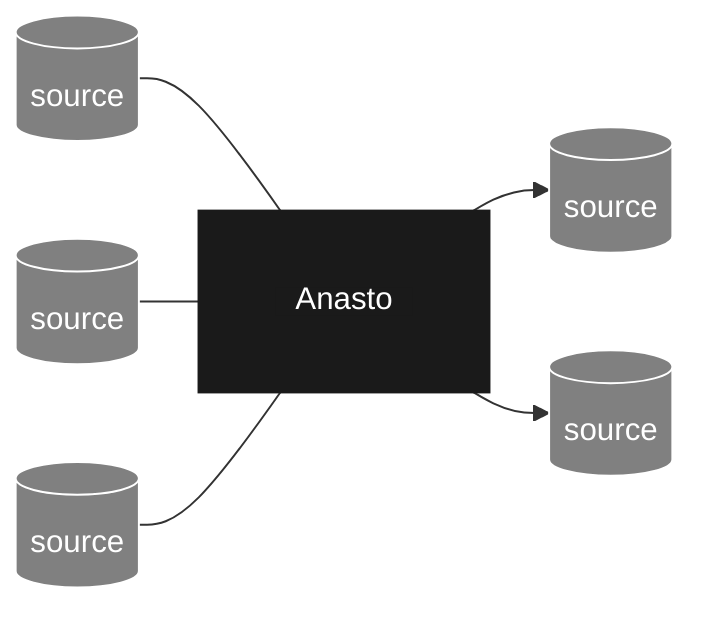
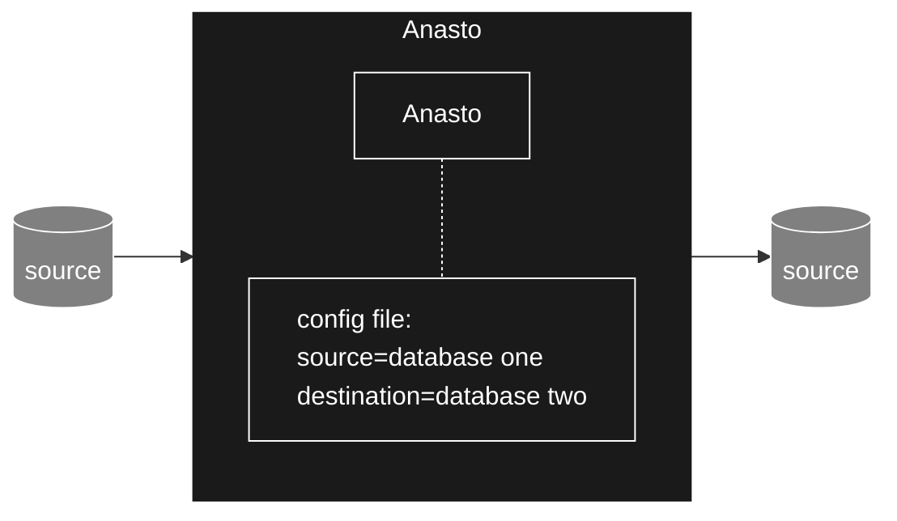
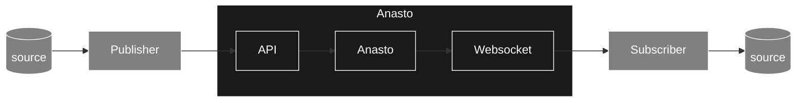
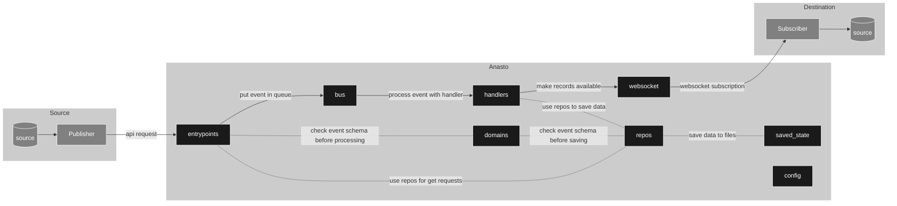

The idea of Anasto is to make it easy to collect real time streaming events and to have them reliably written to various storage destinations. The intention is to produce something that is easy for developers to deploy and integrate with the tech they're currently using.

> Note: Anasto has been started as a personal project and is very much in the early stages. I hope you like it and I would love any feedback or ideas you have but please don't expect a feature rich application that is ready for production (yet :crossed_fingers:).

## Overview
The best way to think of Anasto is as a middleman between source and destination data stores. It will listen to one or more sources and copy all the data it finds to one or more destinations. Anasto favours realtime so changes in sources systems should be heard immediately and copied to the destination systems soon after.


<sub>Note: If this diagram isn't rendering in your markdown viewer, copy and paste the code into this [editor](https://mermaid.live/edit#pako:eNqNkV9rwyAUxb9KsBQ2SKCDPQwHg0Ef97Q9JqXc6LWRGg3-oSul3303jaSslDF98Nzr8SdHT0w4iYwzZdxBdOBj8fHZ2ILGcllY2gtTFVzyAreyrR8mWUiI0ELAxw3n3MUO_Xb0v05-sBCiq98vyyY3iRa1haid_T9pSK3RgZr1rO76QmqD8Lr90zhHM9rub6NV1dt8kvQUgcSVTMXvDPnuGRvikci7DKYC80sUShvDF08wzjJE7_Z4U1YHLWPHn1fDdymccZ4v1GXkS4SBENaoimuiTH1ZjXOm0pE7AFayHn0PWtJ3n8ZOwwjUY8M4SYkKkokNa-yZrJCi-zpawXj0CUuWBvolXGvYeegZV2ACnn8AkkLELA).</sub>

### Low-code design
Anasto is designed for developers who want to interact with tools they're comfortable with such as config files and APIs but don't want to be writing too much code when integrating source and destination systems. Anasto is primarily configured via a config file that defines what source to listen to and what destination to write to.


If the config can't express the source or destination you want to interface with you can revert to Anastos apis and websockets instead. You'll need to write publisher and subscriber scripts to connect your sources and systems to Anasto in this instance.


### Event based
Anasto has been desgined to be an event driven system. That means that it is listening for events happening in source systems, translating them to data and passing them to destination systems who can write them in a way that makes sense to them.

### Subscribers
The term "subscriber" is borrowed from pub/sub systems liek Kafka, AWS Kinesis and GCP pub/sub because subscribers in Anasto behave in much the same way. They receive events from Anasto representing things like new records in source systems or schema changes on your tables of data and write these changes to a destination system. 

At present there is only one pre-built subscriber called `Localfile`. This subscriber writes all records it receives to the localfile system of the machine that Anasto is running on in a format much like a data lake. It splits the records into one directory per schema so that the records are easy to read into tables by tools like [Python Pandas](https://pandas.pydata.org/) and [Polars](https://www.pola.rs/). For more information on how to configure this subscriber, see the config section of this [document](#config-file).

## Quickstart
Make sure [Rust](https://www.rust-lang.org/tools/install) is installed on your machine. Then run the command `cargo run` from the root of this directory. This can take a moment if a new version of the programme needs building. Once it's done and running you should see some logs that look a little like this:

```
INFO  bootstrap > Starting Anasto ...
WARN  bootstrap > Could not find the file ./config.toml.
INFO  bootstrap > Reverting to the default configuration for Anasto
INFO  bootstrap > Anasto started
```

See the API commands below to see how you can interact with Anasto. Or if you're done with Anasto simply hit ctrl-c to gracefully shut it down. You can do this shutdown at anytime and Anasto will finish the work it is doing before shutting down meaning you don't lose any data along the way.

## Manually test with Curl requests
The API endpoints are one such way that you can send data to Anasto and to subscribe to data processed through it. Or if you're only using the connectors you can still use the API to manage Anasto and update its config while it's runnning. Here's a brief description of what each endpoint does. 

To stary, when running Anasto locally you can call any of the endpoints like this:

```bash
curl http://127.0.0.1:3030/<endpoint>
```

### GET /health
The health endpoint is a health check that tells you if the API is still responding to requests. The response looks a little like this:

```json
{
	"code": 200,
	"state": "good"
}
```

Example request:
```bash
curl http://127.0.0.1:3030/health
```

### POST /record
The record endpoint is used to publish new records to Anasto. Records you publish to Anasto will be grouped by their `table_name` and sent to subscribers who will create a table (or equivalent if they don't use tables) for each 'table_name'.

Below is an example request body for making requests to this endpoint.

```json
{ 
    "table_name": "users",
    "event_type": "RECORD",
    "record": {
        "id": 1,
        "name": "Dave"
    },
    "operation": "CREATE",
    "created_at": "2022-07-08T09:10:11Z",
    "event_id": "b0a3649d-4a27-457a-b097-8c1ca85656e2"
}
```

And here's a description of each field:
| Field name | Data type | Required | Description |
|------------|-----------|----------|-------------|
| table_name | string | Yes | The name of the table this record belongs to. |
| event_type | string | No | Will always equal "RECORD". This will be silently corrected if you enter another value. |
| record | map | Yes | The record you want to publish to Anasto represented as key value pairs. |
| operation | string | No | Whether this event represents the record getting created, updated or deleted. The only valid values for this field are "CREATE", "UPDATE" and "DELETE". |
| created_at | date | No | The time and date when this event was first created. Defaults to time and date it entered Anasto if not provided. |
| event_id | uuid | No | The unique identifier of this event. A random (but still unique) id is generated for you if you don't include this field. |

Here's an example request you can make using curl. This request will add a record to the "users" table.
```bash
curl -X POST -H "Content-Type: application/json" -d '{ "table_name": "users", "record": {"id": 1,"name": "Dave"}}' http://127.0.0.1:3030/record
```

The response will be a copy of the request with a 201 status code. Any optional fields missing on the in the request body will be filled with defaults:
```json
{
    "table_name": "users",
    "event_type": "RECORD",
    "record":{ "id": 1, "name": "Dave" },
    "operation": "CREATE",
    "created_at":[2023,124,6,41,15,996616000,0,0,0],
    "event_id": "530155cb-0e7b-495e-9252-5046adc0176b"
}
```

If a schema does not already exist for this `table_name`, one will be created for you. This schema will get saved to file in a directory called `schemas`. Anasto will read this file on startup so if you stop and start Anasto your new schema will not be lost. If a schema does exist for the `table_name` the record will be checked against it and a 400 status code returned if the record does not comply with the schema.

### POST /schema
You can create your own event schemas and ask Anasto to enforce them through the `schema` endpoint. Event schemas use the [Avro spec](https://avro.apache.org/docs/1.11.1/specification/). The body for this request looks like this example:
```json
{ 
    "table_name": "users",
    "schema": { 
        "type": "record",
        "name": "users",
        "fields": [
            {"name": "id", "type": "string"}
        ] 
    },
    "event_type": "SCHEMA",    
    "created_at": "2022-07-08T09:10:11Z",
    "key_properties": [],
    "event_id": "b0a3649d-4a27-457a-b097-8c1ca85656e2",
    "operation": "CREATE"
}
```

Here's a description of each field:
| Field name | Data type | Required | Description |
|------------|-----------|----------|-------------|
| table_name | string | Yes | The name of the table this schema defines. |
| schema | string | Yes | An Avro schema compatible description of a record event type. See [this site](https://avro.apache.org/docs/1.11.1/specification/) for the details of Avro schemas. Despite the schema being a map, the value must be represented as a string. |
| event_type | string | No | Will always equal "SCHEMA". |
| created_at | date | No | The time and date when this Schema was first created. Defaults to the time and date it entered Anasto if not provided. |
| key_properties | array | No | The field names that make up the records primary key. |
| event_id | uuid | No | The unique identifier of this event. |
| operation | string | No | Whether this event represents the event getting created, updated or deleted. |

Here's an example request you can make using curl. This request will create a schema for the "users" table.
```bash
curl -X POST -H "Content-Type: application/json" -d '{ "table_name": "users","schema": "{ \"type\": \"record\", \"name\": \"users\",\"fields\": [ { \"name\": \"id\", \"type\": \"long\" }, { \"name\": \"name\", \"type\": \"string\" } ] }" }' http://127.0.0.1:3030/schema
```

The response will be a copy of the request with a 201 status code. Any optional fields missing in the request body will be filled with defaults:
```json
{
    "table_name": "users",
    "schema":
    {
        "type": "record",
        "name": "users",
        "fields":
        [
            {
                "name": "id",
                "type": "long"
            },
            {
                "name": "name",
                "type": "string"
            }
        ]
    },
    "event_type": "SCHEMA",
    "created_at": "2023-05-05T06:34:57.972071Z",
    "key_properties": [],
    "event_id": "3a6a32b7-7b0b-4343-a12f-e8e99d279520",
    "operation": "CREATE"
}
```

Naturally schemas will be required to evolve over time as source and destination systems add, update and remove fields in their records. You can update your schemas by hitting this endpoint with a schema whose `table_name` matches an existing schema. Anasto will attempt to update the schema but will abide by Avros [schema evolution rules](https://docs.confluent.io/platform/current/schema-registry/fundamentals/avro.html). Anasto uses the "FULL" compatibility rules. If your change breaks these rules (i.e. you've introduced a breaking change), the endpoint will reject your request and return a "Bad Request" HTTP status code.

### GET /schema
You can get a copy of any schema that Anasto is enforcing by using a get request on the schema endpoint. You specify the schema you'd like with the `table_name` parameter. Here's an example that gets the schema for the "users" table:
```bash
curl http://127.0.0.1:3030/schema?table_name=users
```

Which responds with (assuming the schema exists):
```json
{
    "table_name": "users",
    "schema":
    {
        "type": "record",
        "name": "users",
        "fields":
        [
            {
                "name": "id",
                "type": "long"
            },
            {
                "name": "name",
                "type": "string"
            }
        ]
    },
    "event_type": "SCHEMA",
    "created_at": "2023-05-05T06:34:57.972071Z",
    "key_properties": [],
    "event_id": "3a6a32b7-7b0b-4343-a12f-e8e99d279520",
    "operation": "CREATE"
}
```


### WEBSOCKET /subscribe
The subscribe endpoint differs from the other endpoints in that it is a [Websocket](https://www.twilio.com/docs/glossary/what-are-websockets) rather than a REST endpoint. Users can use this endpoint to listen for new events in real time instead of needing to poll for changes. 

Try this command to establish a handshake and subscribe to all new events sent to Anasto:
```bash
curl --include \
     --no-buffer \
     --header "Connection: Upgrade" \
     --header "Upgrade: websocket" \
     --header "Host: 127.0.0.1:3030" \
     --header "Origin: http://127.0.0.1:3030" \
     --header "Sec-WebSocket-Key: SGVsbG8sIHdvcmxkIQ==" \
     --header "Sec-WebSocket-Version: 13" \
     --output - \
     http://127.0.0.1:3030/subscribe
```

You should receive a positive response like this:
```bash
HTTP/1.1 101 Switching Protocols
connection: upgrade
upgrade: websocket
sec-websocket-accept: qGEgH3En71di5rrssAZTmtRTyFk=
date: Wed, 04 Jan 2023 16:12:56 GMT
```

Then in a new window try sending a record to the `POST /record` endpoint:
```bash
curl -X POST -H "Content-Type: application/json" -d '{ "table_name": "users", "record": {"id": 1,"name": "Dave"}}' http://127.0.0.1:3030/record
```

After 60 seconds you should see the event appear in your terminal (in the window that subscribed to the websocket). This will be in binary but your terminal should translate it into a string representing json like this:
```json
[{"created_at":[2023,125,18,42,19,878273000,0,0,0],"event_id":"d6512c1d-4408-4131-86e0-77c9523e6930","event_type":"RECORD","operation":"CREATE","record":{"id":1,"name":"Dave"},"table_name":"users"}]
```

## How to build, configure and run Anasto
Anasto is still an early stage project and as such it does not come pre-built. So you'll need to build Anasto before you can run it and since Anasto is written in Rust you'll need to install Rust on your machine. You can find instructions on how to do that [here](https://www.rust-lang.org/tools/install).

Once you have Rust installed, run this to build Anasto (this may take a little while):
```bash
cargo build --release
```

Building Anasto will create the `./target/release/main` file. This is a binary executable file that can now be run independent of Rust (so you can remove Rust from your computer if you like). With your binary build you can run Anasto with the command:
```bash
./target/release/main
```

### Config file
Anasto comes with a default set of configurations to help you get it running for the first time with minimal effort. However you can change the config by editing a config file. Be default Anasto will look for a config file called: `./config.toml`. You can put the file somewhere else if you like and add an argument to the run command to specify where it lives:
```bash
./target/release/main ./another_folder/config.toml
```

Config files are written in the [toml](https://toml.io) language and look a little like this:
```toml
[api]
ip = '0.0.0.0'
port = 8080
max_request_size = 16000

[stream]
max_capacity = 300
max_memory = 2000000
max_event_age = 120

[schemas]
url = './test_schemas/basic/'

[[subscriber]]
type = "Localfile"
name = "my_jsonl_subscriber"
dirpath = "./jsonl_destination/"
filetype = "jsonl"

[[subscriber]]
type = "Localfile"
name = "my_csv_subscriber"
dirpath = "./csv_destination/"
filetype = "csv"
```

Here's a description of the fields you could include. Don't worry about missing any out. If you don't include a field it will revert to a default value:

| Table | Field name | Data Type | Description |
|-------|------------|-----------|-------------|
| api | ip | string | The ip that the API will listen for requests on. Defaults to "127.0.0.1" if it's not included. |
| api | port | number | The port number that the API will listen for requests on. Defaults to 3030 if it's not included. |
| api | max_request_size | number | The maximum size of an api request measured in bytes. Any API request with more bytes in it is rejected. Defaults to 16384 bytes if not specified. |
| stream | max_capacity | number | The records sent to Anasto will be grouped into small batches called buffers before they're sent to a subscriber. This field specifies the maximum number of records a buffer can include. Once the number is exceeded the buffer is drained and the records sent to all subscribers. Defaults to 100 records if not specified. |
| stream | max_memory | number | The records sent to Anasto will be grouped into small batches called buffers before they're sent to a subscriber. This field specifies the maximum number of bytes a buffer can include. Once the size is exceeded the buffer is drained and the records sent to all subscribers. Defaults to 1000000 bytes if not specified. |
| stream | max_event_age | number | The records sent to Anasto will be grouped into small batches called buffers before they're sent to a subscriber. If a buffer never exceeds its `max_memory` or `max_event_age` if will be drained after the number of seconds specified here and the records sent to all subscribers. Defaults to 60 seconds if not specified. |
| schemas | url | string | The record schemas by default will be stored in the directory `./schemas/`. You can specify another path here. |
| subscriber | type | string | There will be many different types of subscribers available in the future. Each type describes what type of data storage you would like your data written to. At present the only value you can put here is `Localfile` as that is the only subscriber available. |
| subscriber | name | string | A unique name to give to your subscriber. The logs related to this subscriber will be tagged with this value. |
| subscriber | dirpath | string | Relates to the `Localfile` subscriber and defines where in your localfile system you would like Anasto to write files to. Although a string this value must be a correctly formatted directory path. Relative as well as absolute paths are allowed. |
| subscriber | filetype | string | Relates to the `Localfile` subscriber and defines what type of file you would like to write to the location you defined in the `dirpath` field. The available filetypes are `jsonl`, `csv`, `avro` and `parquet`. |
| subscriber | keep_headers | bool | Relates to the `Localfile` subscriber and defines whether you would like to keep the header fields when a record is written to a file. That is would you like to include the `table_name`, `event_type`, `operation`, `created_at` and `event_id` as well as the contents of the `record` itself. |

Remember that if you are including a subscriber in your config you must enclose it in two square brackets like this `[[subscriber]]` and not single brackets like this `[subscriber]`. This is because you can include many subscribers in your config.


### Schema files
Anasto enforces schemas on all the records it processes so that it is able to pass data to subscribers in a reliable and consistent format. Without this subscribers may receive data that they can't write to their destination systems. 

By default Anasto will start with no schemas loaded into it. However it will look for a directory called `./schemas/` to see if previous runs of Anasto created schemas or if the user wants schemas pre-loaded when Anasto starts. See [Config file](#config-file) if you'd like the schemas stored somewhere else. 

If you'd like to pre-load your own schemas and aren't sure what they should look like or where they should be stored, start running [Anasto](#quickstart) and hit the [schema endpoint](#post-/schema) to see what the schema files look like.

## Architecture and code layout overview
Anastos code design loosely follows domain-driven design and event-driven architecture principles. The idea is that Anasto is reacting to events happening in other systems (sources), ingesting those events and writing the events to other systems (destinations). 

So to start exploring how Anasto works begin at the `entrypoints` part of the codebase. This is an API whose purpose is to ingest these events through the `\record` endpoint. Follow the arrows in this diagram to see the journey of an event from source to destination:



| Component      | Description |
|----------------|-------------|
| **entrypoint** | The point at which sources and destinations can interface with Anasto. Specifically it enables events to be sent and received by producers and subscribers in a similar way to how streaming services work. <br><br>When entrypoints receive an event it validates it using the `domains` and then sends it to the message `bus` for processing. When it sends a group of events to a destination it does it through a websocket. If it needs to get any data from the saved state it uses the `queries` interface. |
| **domains**    | Domains represent the objects or entities that Anasto works with. Since Anasto was designed to handle events the domains mostly define the types of events that Anasto understands. Domains then is a list of event types, the fields each type contains and the rules that govern what values can go in each field. <br><br>`entrypoints` uses domains to validate the events that sources send to it as API requests. `repos` are collections of events so need domains to define the events it collects. |
| **bus**        | The message `bus` is a queue of events received from sources and produced by Anasto (system events). It then decides which `handler` to use to process the event. |
| **handlers**   | `Handlers` are the logic used to process different types of events. If it needs to save any data either in memory or persisted to disk it will uses the `repos`. |
| **repos**      | The repositories serve two purposes; to collect events into groups and to persist some of them into a saved state (so Anasto can pick up where it left off if it fails for one reason or another). <br><br>The collection of events is done for a variety of reasons including saving a register of schema events to be referred to later and to buffer record type events so they don't overwhelm destination systems. <br><br>The persistence of some repos acts as a decoupling between the `handlers` and a database (in this case the local filesystem). This decoupling allows a consistent interface to save events even if the underlying database gets changed. |
| **queries**    | Similar to `repos` but this time the purpose is to provide a consistent interface for reading data from the database. It simplifies the `repos` to keep the reads separate from the writes. |

## Where the name comes from
The name is short for the word anastomosis which according to [Wikipedia](https://en.wikipedia.org/wiki/Anastomosis) "is a connection or opening between two things (especially cavities or passages) that are normally diverging or branching, such as between blood vessels, leaf veins, or streams." This sort of describes what the tool does which is take an event as input and output it to one or more destinations. More than that though the name is quite unique and vague enough to allow flexibility in the tools future features.