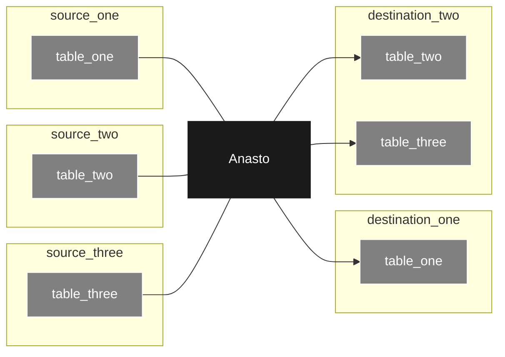

[](https://github.com/MattBast/anasto/actions/workflows/tests.yml)

Sync data from source system tables into destination lakes, warehouses and databases with nothing more than a config file.

> Note: Anasto has been started as a personal project and is very much in the early stages. I hope you like it and I would love any feedback or ideas you have but please don't expect a feature rich application that is ready for production (yet :crossed_fingers:).

Anasto is a middleman synchronising source and destination data stores. It will listen to one or more sources and copy all the data it finds to one or more destinations. Anasto favours near realtime synchronisation meaning that changes in sources systems should be "heard" quickly and copied to the destination systems soon after.


<sub>Note: If this diagram isn't rendering in your markdown viewer, copy and paste the code into this [editor](https://mermaid.live/).</sub>


## Quickstart
Make sure [Rust](https://www.rust-lang.org/tools/install) is installed on your machine. Make sure the Rust toolchain is installed by running this command on your command line (you may need to restart your command line after installing Rust for this command to work):

```bash
cargo --version
```

Now you'll need to create a config file to specify what sources of data you'd like to read and what destinations that data should be written to. Create your file with the command `touch ./config.toml`. Open the file and add this content to it:

```toml
[[source_table]]
type = "files"
table_name = "csv_table"
dirpath = "./csv_table/"

[[destination_table]]
type = "files"
source_table_name = "csv_table"
dest_table_name = "json_table"
dirpath = "./json_table/"
filetype = "json"
```

This file reads from csv files found in the `./csv_table/` directory and writes them as json files in the `./json_table/` directory. For more information on what can be included in a config file, see this section: [The Config File](#the-config-file). 

Now create the two directories for the tables:
```bash
mkdir ./csv_table/
mkdir ./json_table/
```

And finally start Anasto and point it at your config file:
```bash
cargo run ./config.toml
```

Anasto will start polling `./csv_table/` looking for new files to read. Try adding some csv files to the directory to see them copied across to the `./json_table/` directory. Note that Anasto expects only one table per directory so all the csv files you add will need a compatible schema (i.e. all the values added to a column with the same column across the files needs the same data type).

## The Config File
Anasto is configured via a single toml file. This [introduction page](https://toml.io) is worth a read if you haven't worked with toml files before.

The config file consists of a list of tables written in the [toml format](https://toml.io/en/v1.0.0#table). Each table represents a single table of data either in a source system that you'd like to read from or a destination that you'd like to write to. You can specify whether a table is a source or a destination using these headers surrounded by two sets of square brackets:

```toml
[[source_table]]

[[destination_table]]
```

The details of the tables are then included under these headers. All tables include the `type` field to specify what type of table you are reading from or writing to. In the example below we are reading and writing to files on the local filesystem. Notice as well that the `destination_table` needs to specify which `source_table` it is synchronising with by specifying the `source_table` name in its `source_table_name` field:

```toml
[[source_table]]
type = "files"
table_name = "csv_table"
dirpath = "./csv_table/"

[[destination_table]]
type = "files"
source_table_name = "csv_table"
dest_table_name = "json_table"
dirpath = "./json_table/"
filetype = "json"
```

Now let's get into the details of each possible source and destination type currently available in Anasto:

### Files (Source Table) 
A source table that is read from the local filesystem. It works by polling a specified file directory and reading all the files that have been created since Anasto polled the directory. A timestamp bookmark is kept and compared against a files created timestamp to track what files need to be read per poll.

Here's an example:
```toml
[[source_table]]
type = "files"
table_name = "csv_table"
dirpath = "./csv_table/"
filetype = "csv"
bookmark = "2023-08-21T00:55:00z"
poll_interval = 10000
on_fail = "stop"
```

And here's a description of each of the fields:

| Field Name    | Data Type      | Description                                                                                                                                                                                                                     |
|---------------|----------------|---------------------------------------------------------------------------------------------------------------------------------------------------------------------------------------------------------------------------------|
| table_name    | String         | A user defined name for the table. This does not need to correlate with the directory path where the tables files are stored.                                                                                                   |
| dirpath       | Path           | The directory filepath where all data in this table is stored.                                                                                                                                                                  |
| filetype      | Enum           | Optional field. The type of file that the tables data is stored in. Available formats are `csv`, `json`, `avro` and `parquet`. Defaults to `csv`.                                                                               |
| bookmark      | Datetime (UTC) | Optional field. Filter out any files whose created date is earlier than this bookmark. Defaults to "1970-01-01T00:00:00z".                                                                                                      |
| poll_interval | int64          | Optional field. Determines how frequently new data will be read from the source. Provided in milliseconds. Defaults to 10000.                                                                                             |
| on_fail       | Enum           | Optional field. Decide what to do when new data fails to be read from the source. Available values are `stop` (stops Anasto reading the table) and `skip` (Anasto skips the batch with an error in it). Defaults to `stop`. |

### Open Table (Source Table) 
A source table that is read read from a local open table database like [Delta Lake](https://delta.io/). It works by polling the change data feed files and reading a stream of these change events. Note that for now this table only supports the delta lake format. The Iceberg format will be added once the [Apache Iceberg crate](https://github.com/apache/iceberg-rust) matures.

Here's an example:
```toml
[[source_table]]
type = "files"
table_name = "delta_table"
dirpath = "./delta_table/" 
format = "delta_lake"
bookmark = "2023-08-21T00:55:00z"
poll_interval = 5000
on_fail = "skip"
```

And here's a description of each of the fields:

| Field Name    | Data Type      | Description                                                                                                                                                                                                                 |
|---------------|----------------|-----------------------------------------------------------------------------------------------------------------------------------------------------------------------------------------------------------------------------|
| table_name    | String         | A user defined name for the table. This does not need to correlate with the directory path where the tables files are stored.                                                                                               |
| dirpath       | Path           | The directory filepath where all data in this table is stored.                                                                                                                                                              |
| format        | Enum           | Optional field. The open table format that the tables data is stored in. The only format available is `delta_lake`. Defaults to `delta_lake`.                                                                               |
| bookmark      | Datetime (UTC) | Optional field. Filter out any change feed events whose committed date is earlier than this bookmark. Defaults to "1970-01-01T00:00:00z".                                                                                   |
| poll_interval | int64          | Optional field. Determines how frequently new data will be read from the source. Provided in milliseconds. Defaults to 10000.                                                                                               |
| on_fail       | Enum           | Optional field. Decide what to do when new data fails to be read from the source. Available values are `stop` (stops Anasto reading the table) and `skip` (Anasto skips the batch with an error in it). Defaults to `stop`. |

### Files (Destination Table) 
A destination table that is written to the local filesystem. It writes one or more files of data to the specified directory for every new batch of data it receives from source.

Here's an example:
```toml
[[destination_table]]
type = "files"
source_table_name = "csv_table"
dest_table_name = "json_table"
dirpath = "./json_table/"
filetype = "json"
on_fail = "skip"
```

And here's a description of each of the fields:

| Field Name        | Data Type | Description                                                                                                                                                                                                                         |
|-------------------|-----------|-------------------------------------------------------------------------------------------------------------------------------------------------------------------------------------------------------------------------------------|
| dest_table_name   | String    | A user defined name for the table. This does not need to correlate with the directory path where the tables files will be written to.                                                                                               |
| source_table_name | String    | The name of the source table that supplies this destination table. There must be a `source_table` in the config file with this table name.                                                                                          |
| dirpath           | Path      | The directory filepath where all data in this table will be written to.                                                                                                                                                             |
| filetype          | Enum      | Optional field. The type of file that the tables data will be written to. Available formats are `csv`, `json`, `avro` and `parquet`. Defaults to `csv`.                                                                             |
| on_fail           | Enum      | Optional field. Decide what to do when new data fails to be written to a destination. Available values are `stop` (stops Anasto writing to this table) and `skip` (Anasto skips the batch with an error in it). Defaults to `stop`. |


### Open Table (Destination Table) 
A destination table that is written to a local open table database like [Delta Lake](https://delta.io/). It writes one or more files of data to the specified directory for every new batch of data it receives from source. Note that for now this table only supports the delta lake format. The Iceberg format will be added once the [Apache Iceberg crate](https://github.com/apache/iceberg-rust) matures.

Here's an example:
```toml
[[destination_table]]
type = "files"
source_table_name = "json_table"
dest_table_name = "delta_table"
dirpath = "./delta_table/"
format = "delta_lake"
on_fail = "skip"
```

And here's a description of each of the fields:

| Field Name        | Data Type | Description                                                                                                                                                                                                                         |
|-------------------|-----------|-------------------------------------------------------------------------------------------------------------------------------------------------------------------------------------------------------------------------------------|
| dest_table_name   | String    | A user defined name for the table. This does not need to correlate with the directory path where the tables files will be written to.                                                                                               |
| source_table_name | String    | The name of the source table that supplies this destination table. There must be a `source_table` in the config file with this table name.                                                                                          |
| dirpath           | Path      | The directory filepath where all data in this table will be written to.                                                                                                                                                             |
| format            | Enum      | Optional field. The open table format that the tables data is stored in. The only format available is `delta_lake`. Defaults to `delta_lake`                                                                                        |
| on_fail           | Enum      | Optional field. Decide what to do when new data fails to be written to a destination. Available values are `stop` (stops Anasto writing to this table) and `skip` (Anasto skips the batch with an error in it). Defaults to `stop`. |

## Where the name comes from
The name is short for the word anastomosis which according to [Wikipedia](https://en.wikipedia.org/wiki/Anastomosis) "is a connection or opening between two things (especially cavities or passages) that are normally diverging or branching, such as between blood vessels, leaf veins, or streams." This sort of describes what the tool does which is take an event as input and output it to one or more destinations. More than that though the name is quite unique and vague enough to allow flexibility in the tools future features.